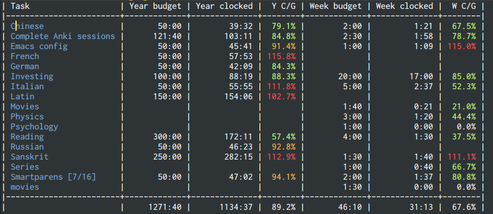

# org-clock-budget

Budget your time with `org-mode`!

# Usage

## Adding budgets

You can specify the intervals you want to use by customizing
`org-clock-budget-intervals`.

Currently four intervals are built-in, week, month, quarter (3-month
periods starting January 1st) and year. To add a budget on a task, add
a property (`C-c C-x p`) called either `BUDGET_WEEK`, `BUDGET_MONTH`,
`BUDGET_QUARTER`, or `BUDGET_YEAR`.

In addition, users can also define their own intervals by adding a
name and a function calculating the `(FROM . TO)` interval for your
name to `org-clock-budget-intervals`.

The properties can hold two types of values, either a number which is
then interpreted as number of minutes or a `HH:MM` string which is
parsed in the obvious way.

The budgets are repeating, which means each next interval will get the
same budget as the previous.  You can remove the property to remove
the budget.

You can specify how many hours per day you want to have available for
budgeting (i.e. _budgetable_).  This is configured with
`org-clock-budget-daily-budgetable-hours`.  By default it's 12 hours,
assuming the 8 hour work day with 4 hours of leisure activities.  The
number of hours per budget-interval is calculated based on the number
of days in said interval, that is 7 for a week, 28-31 for months and
so on.

## Running reports

Run `M-x org-clock-budget-report`.  You can click on the names to jump
to the task.  Hitting `s` on a column will sort, hitting `s` again
will resort in opposite direction.  Hitting `g` reloads the report.

This is how the report looks:



For every enabled interval you will get three columns, first the
budget, then the real clocked time and last a percentage of used up
budget.  When you go over 100% it means you are overspending.  The
groups are (horizontally) ordered the same way as
`org-clock-budget-intervals`.

The report also includes a row describing how many hours from the
interval are already budgeted and how many can still be assigned to an
activity:

```
| Task                | Y budget | Y clocked | Y C/G | M budget | M clocked | M C/G | W budget | W clocked | W C/G |
|---------------------+----------+-----------+-------+----------+-----------+-------+----------+-----------+-------|
    ...
    ...
| Budgeted/Clocked    |  3502:00 |   1468:06 | 41.9% |   122:00 |     50:05 | 41.1% |    75:20 |      0:00 |  0.0% |
|---------------------+----------+-----------+-------+----------+-----------+-------+----------+-----------+-------|
| Budgetable hours    |  4392:00 |    890:00 | 79.7% |   372:00 |    250:00 | 32.8% |    84:00 |      8:40 | 89.7% |

legend for the last row: ^Total budgetable hours
                                      ^Remaining hours to budget
                                               ^ Ratio of how many hours are budgeted against the total
```

The colors can be customized using `org-clock-budget-ratio-faces` and
`org-clock-budgeted-ratio-faces`.

# F.A.Q.

## How does this differ from Effort estimates?

Effort is an estimate of how long a task will take you to complete.
You might get overdue or finish sooner, and that's fine because
estimates are guesswork.  However, time/clock budget is a fixed
quantity you can't go overdue with.  A person working 40-hour week has
only about 40 hours of free time (5h for 5 work days and 2x10 for
weekend), and that's it.

To *plan* your tasks you use effort estimates, to schedule them within
weeks or months you use *budget* (sometimes called *capacity* or
*goal*).

For example, you can have a task which might have 30 hour estimate,
and you wish to work on it for 3 weeks.  Therefore, you'd budget 10
hours weekly to work on this task and no more, allocating the rest of
the time to other tasks.  If your estimate was too little, you will
simply extend the period for another week of 10 hours.  If it was too
much, you can re-budget the surplus time on other tasks.

## Why should I want to budget my time?

Resource allocation is the basis of effectivity.  With a purposeful
budget you won't get overwhelmed about thinking what to do when.  Once
you use up all your hours it means you need to work on something else.
This way you can spread your work on different tasks to avoid burnout.
Coupled with basic scheduling this can lead to surprising amount of
"administration" time saved.

## When should I budget my time?

A "recommended" work-flow is to have a weekly (or by-weekly) recurring
task called "Plan for next week" (fortnight/month...) where you
consolidate your tasks and refine your budgets, review stale tasks
etc.  This can take anywhere from 10 to 60 minutes depending on your
level of sophistication.  Hitting the sweet-spot of not wasting more
time than necessary while freeing you from all the cognitive burden
during the week might take some practice and discipline.
